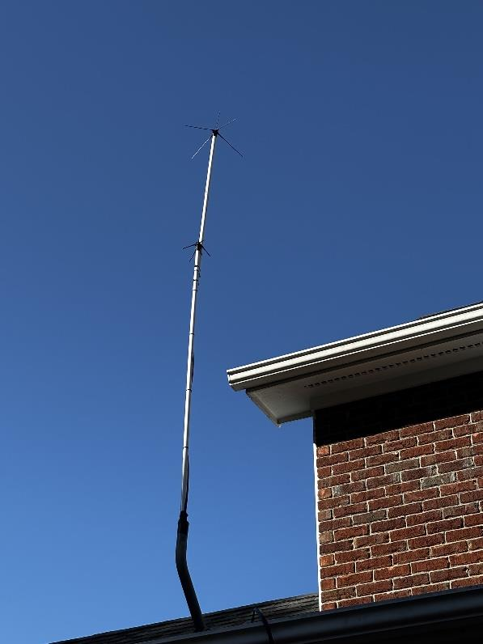
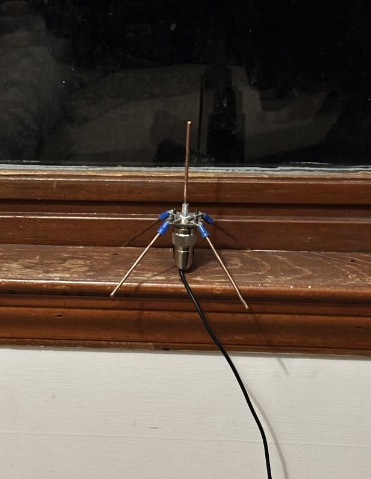
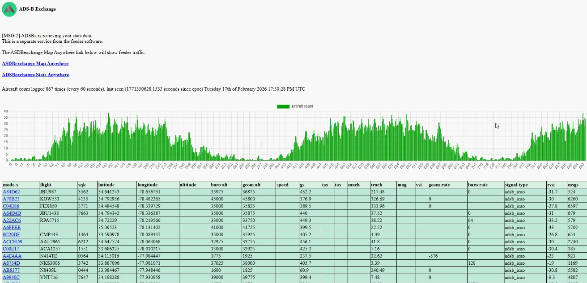
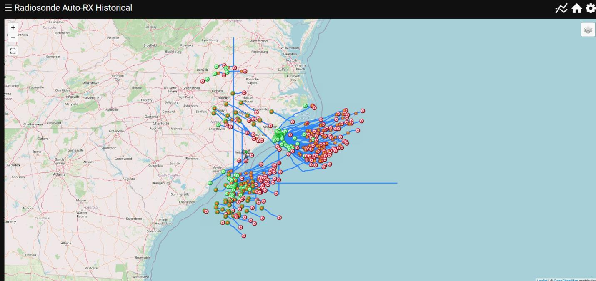

# Tracking Weather Balloons and Planes using USB RTL-SDRs

This guide shows you how to build and run a dual-purpose receiving station that can decode ADS-B broadcasts from aircraft and track weather balloon radiosondes using inexpensive RTL-SDR USB dongles. You'll see which hardware and software to use, why each step matters, and how to verify that everything works. The focus is on Linux (Debian/Ubuntu), but notes for Windows are provided where appropriate. If you're brand-new to software-defined radio (SDR) or radio frequency (RF) work, don't worry – we'll break down each step so you know what you're doing and why.

---

## Table of Contents

1. [What We're Tracking and Why](#1-what-were-tracking-and-why)
2. [Hardware Overview](#2-hardware-overview)
3. [Hardware Setup](#3-hardware-setup)
4. [1/4-Wave Ground-Plane Antennas (Build Guide)](#4-14-wave-ground-plane-antennas-build-guide)
5. [Weatherproofing Your Antennas (3D-Printed Radome)](#5-weatherproofing-your-antennas-3d-printed-radome)
6. [Example Antenna Installations](#6-example-antenna-installations)
7. [Software Setup](#7-software-setup)
8. [Installing RTL-SDR Drivers](#8-installing-rtl-sdr-drivers)
9. [Verifying Your SDRs](#9-verifying-your-sdrs)
10. [ADS-B Decoding with readsb/tar1090](#10-ads-b-decoding-with-readsbtar1090)
11. [Tracking Radiosondes with radiosonde_auto_rx](#11-tracking-radiosondes-with-radiosonde_auto_rx)
12. [Running Decoders as Services (systemd & Docker)](#12-running-decoders-as-services-systemd--docker)
13. [Visualization and Data](#13-visualization-and-data)
14. [Example Results and Maps](#14-example-results-and-maps)
15. [Validating a Healthy ADS-B Station](#15-validating-a-healthy-ads-b-station)
16. [Troubleshooting](#16-troubleshooting)
17. [Safety & Legal](#17-safety--legal)
18. [Next Upgrades](#18-next-upgrades)

---

## 1. What We're Tracking and Why

### ADS-B Aircraft Signals

- **ADS-B** (Automatic Dependent Surveillance–Broadcast) is a surveillance technology where aircraft periodically broadcast their identity, GPS position, altitude and other flight information. The primary frequencies are **1090 MHz** and **978 MHz**. 1090 MHz is used worldwide and by Mode A/C/S transponders.
- By listening on 1090 MHz you can see real-time aircraft positions. This is great for aviation enthusiasts and also serves as a reference to verify your antenna and SDR setup.

### Weather Balloon Radiosondes

- Radiosondes are sensor packages carried by weather balloons. They transmit temperature, humidity, pressure and GPS position back to ground stations.
- Radiosondes typically operate around **403 MHz** or **1680 MHz**. The U.S. National Weather Service's LMS-6 radiosonde transmits on specific channels in the 1680 MHz and 403 MHz bands. Other models, like Vaisala RS92, also use ~403 MHz.
- Because the exact frequency varies by station and region, you must confirm which band your local launches use. Sites such as the [SondeHub map](https://tracker.sondehub.org/) allow you to click a station and see its launch schedule and frequency.

### Why Use Two SDRs?

- A single RTL-SDR can only monitor one frequency at a time. ADS-B (1090 MHz) and radiosondes (~400 MHz/1680 MHz) are far apart. Running two SDRs lets you decode both at once. You can start with one SDR and add another later.

---

## 2. Hardware Overview

Below is a breakdown of each piece of hardware used in this build. Required items are needed for the minimum build (tracking either planes or balloons). Optional items enable better performance or future upgrades.

| Item | Purpose |
|------|---------|
| USB-SDR (RTL Blog V4 and Nooelec NESDR SMArt v5) | Compact, USB-powered receivers—commonly based on RTL2832U chips. |
| SMA-male to F-female adapters | Adapts SDR SMA connectors to F-type connectors used on coax, making it easy to attach inexpensive RG-6 coax cable. |
| CNARIO PL-259 to F Adapter | Adapts older PL-259/UHF connectors to F-type. Useful if you build an antenna with an SO-239 (UHF) connector and need to connect F-type coax. |
| UHF Panel Mount SO-239 | Provides a sturdy connector for the center of your DIY antenna. The SO-239 mates with a PL-259 or F adapter. |
| 10 AWG solid copper wire | Used to build the antenna elements (vertical radiator and ground radials). Solid 10 AWG is stiff enough to hold its shape. |
| Coaxial Cable (RG-6 with F connectors) | Connects the antenna to the SDR. RG-6 is affordable and has low loss at 400–1100 MHz. |

### Minimum Build vs. Upgrade Path

**Minimum build:**
- One RTL-SDR (preferably with TCXO)
- DIY quarter-wave ground-plane antenna for your target band (choose 1090 MHz for planes or 403 MHz for balloons)
- RG-6 coax and SMA-to-F adapters

**Upgrade build:**
- Second SDR for simultaneous plane and balloon tracking
- Dedicated antennas for each band
- Optional band-pass filters
- Powered USB hub to avoid USB power drops

---

## 3. Hardware Setup

### 1. Plan Your Antenna Locations

- **What you do:** Decide where you'll place antennas. Ideally, mount them outdoors or in an attic with line-of-sight to the horizon. The ADS-B (1090 MHz) antenna is small enough for a window sill; radiosonde antennas (403 MHz) benefit from being higher due to longer wavelengths.
- **Why:** RF signals at these frequencies are mostly line-of-sight. The fewer obstacles, the better your reception.
- **Verify:** Use your phone's compass or a map to ensure your antenna has a clear view of the sky in all directions.
- **If it didn't work:** If you're in an RF-noisy apartment, move the antenna away from electronics; try placing it near a window or outside with weatherproofing.

### 2. Build or Buy Antennas

- **What you do:** Build quarter-wave ground-plane antennas (see [antenna guide](#4-14-wave-ground-plane-antennas-build-guide)) for each band you plan to monitor. Use the SO-239 panel mount as the base, solid 10 AWG copper wire for the vertical radiator and radials, and F- or PL-259 adapters to connect coax.
- **Why:** Quarter-wave ground-plane antennas are simple, inexpensive and perform well. Building them yourself ensures they're tuned to your specific frequencies and uses the copper wire you already have.
- **Verify:** Measure each element carefully and test using the RTL-SDR before final assembly. If you have an antenna analyzer (VNA), you can check SWR; otherwise, rely on signal quality tests described later.
- **If it didn't work:** Ensure the vertical element is the correct length; adjust (trim) radials; verify all connections are tight.

### 3. Connect the SDRs

1. Attach the SMA-to-F adapter to your RTL-SDR's SMA port.
2. Connect your RG-6 coax to the F-adapter.
3. Attach the other end of the coax to the antenna via the SO-239 or F connector.
4. Plug the SDR into your computer or a powered USB hub.
5. **Why:** Proper connectors prevent loss and reflections. Solid connections reduce noise and ensure maximum signal transfer.
6. **Verify:** Gently wiggle the connectors; nothing should be loose. Test continuity (center pin to center pin, shield to shield) with a multimeter if possible.
7. **If it didn't work:** Check that the coax connectors are fully seated; look for kinks in the cable; try a different USB port or cable.

---

## 4. 1/4-Wave Ground-Plane Antennas (Build Guide)

Quarter-wave ground-plane antennas consist of a vertical radiator and typically four radial wires attached to a feed point. The vertical element is ¼ of a wavelength long, and the radials are slightly longer (5–12% longer). Sloping the radials downward at ~45° lowers the feed-point impedance and helps match 50 Ω coax.

### Formula for Element Lengths

The speed of light (~299,792,458 m/s) divided by frequency gives the wavelength. For convenience, use the following formula for the radiator length in centimeters:

```
Radiator Length (cm) ≈ (71.5 / f_MHz)
Radials Length (cm)  ≈ Radiator × 1.05 to 1.12
```

This formula is derived from the general quarter-wave relation (quarter wavelength = speed of light / (4 × frequency)). The radials should be 5–12% longer as recommended. Always start slightly long and trim while checking performance.

### Worked Examples

| Application | Frequency & rationale | Radiator length | Radial length (5–12% longer) |
|-------------|----------------------|-----------------|-------------------------------|
| ADS-B (Mode S) | 1090 MHz (1090ES is used worldwide) | 71.5 / 1090 ≈ 0.0656 m → **6.6 cm** (≈ 2.6 in). Rounded to 68–70 mm as shown in ADS-B antenna guides. | 6.6 cm × 1.05–1.12 ≈ **6.9–7.4 cm**. Cut radials ~7 cm and trim. |
| Weather balloon radiosonde (403 MHz) | Radiosondes like Vaisala RS92 and LMS-6 use ~400–406 MHz. Confirm local frequency via SondeHub. Use 403 MHz as a middle value. | 71.5 / 403 ≈ 0.1775 m → **17.8 cm** (≈ 7 in). | 17.8 cm × 1.05–1.12 ≈ **18.7–19.9 cm**. Start around 19 cm. |
| Weather balloon radiosonde (1680 MHz) | Some LMS-6 models transmit at ~1680 MHz (e.g., 1676–1682 MHz). | 71.5 / 1680 ≈ 0.0426 m → **4.3 cm** (≈ 1.7 in). | 4.3 cm × 1.05–1.12 ≈ **4.5–4.8 cm**. |

### Building Steps

1. **Cut the radiator:** Use solid 10 AWG copper wire. Measure the radiator slightly longer than the calculated length; you can trim later.
2. **Prepare the radials:** Cut four radials 5–12% longer than the radiator. Bend them so they can be attached to the SO-239 connector screws or soldered to the flange.
3. **Attach to SO-239:** Solder the vertical radiator to the center pin of the SO-239 panel mount. Attach the radials to the four flange holes or use small screws and nuts.
4. **Set radial angle:** Bend each radial downward to about 45°. This helps achieve near-50 Ω impedance and improves the radiation pattern.
5. **Install connector:** If using an F connector, attach the PL-259-to-F adapter to the SO-239. Otherwise, attach a PL-259 coax plug.
6. **Trim and test:** Use a hacksaw or cutters to trim the radiator in small increments while monitoring signal strength (explained in [Software Setup](#7-software-setup)). Don't worry about perfection – slight mismatches won't prevent decoding.

```
        Radiator
           │
           │  ← ~6.6 cm (1090 MHz example)
           │
─────────────┴─────────────  ← SO-239 panel
  /    /           \    \
 /    /             \    \   ← 4 radials (~7 cm)
```

- **Why build your own:** Commercial antennas are available, but building one lets you optimize for your local frequency and learn the basics of antenna design. It costs a few dollars in materials.
- **Verify:** After connecting to the SDR, you should see aircraft on a map (if building an ADS-B antenna) or detect radiosonde signals during local balloon launches. If signals are weak, adjust the radiator length or radial angles.
- **If it didn't work:** Double-check measurements; ensure radials make good electrical contact; confirm the coax is properly connected.

---

## 5. Weatherproofing Your Antennas (3D-Printed Radome)

If you mount your antennas outdoors, they need protection from UV, rain and wind. A simple 3D-printed radome can shield the copper elements without noticeably affecting tuning. I printed a slim vertical radome from a community design and slid it over both my ADS-B and radiosonde ground-plane antennas. Keep these points in mind:

- **Material:** Use plain PLA or PETG filament. Avoid carbon-fiber or metal-filled filaments, which can detune antennas. Wall thickness around 1–2 mm is sufficient.
- **Ventilation:** Drill a tiny drain hole at the bottom. Condensation inside a sealed radome will detune the antenna and corrode the connector.
- **Effect on tuning:** Thin plastic has negligible effect at 1090 MHz and 403 MHz. After installation, verify that your message rate and signal levels remain stable by checking the graphs discussed later.
- **Benefits:** A radome shields the radiator and radials from weather, UV and bird damage. It extends the life of solder joints and connectors and makes the antenna look tidy.

---

## 6. Example Antenna Installations

Seeing real-world builds helps you visualize the finished product and compare your own work. The photos below show two completed ground-plane antennas mounted on a PVC mast.



*Both antennas on a PVC mast – the smaller top antenna is tuned for 1090 MHz and the larger lower antenna is tuned for ~403 MHz*



*Close-up of the 1090 MHz ADS-B 1/4-wave ground-plane antenna built from 10 AWG copper and an SO-239 base*

- **Mounting:** Note the vertical separation between antennas on the mast. This prevents the resonant elements from detuning each other and improves performance.
- **Radial angle:** The radials are bent downward around 45°, matching the 50 Ω impedance of your coax.
- **Weatherproofing:** The 3D-printed radomes (barely visible in the first image) cover the radiators and radials, protecting them from the elements.

---

## 7. Software Setup

You'll set up two decoding pipelines: one for ADS-B using readsb/tar1090 and another for radiosondes using radiosonde_auto_rx (version 1.8.2 at time of writing). Start with installing the RTL-SDR drivers.

---

## 8. Installing RTL-SDR Drivers

### Linux (Debian/Ubuntu)

1. Update your package lists and install dependencies:

```bash
sudo apt update
sudo apt install -y git build-essential python3 python3-venv python3-pip \
    cmake libusb-1.0-0-dev rtl-sdr
```

2. Blacklist the DVB kernel driver (prevents the dongle being claimed as a TV tuner):

```bash
echo 'blacklist dvb_usb_rtl28xxu' | sudo tee /etc/modprobe.d/blacklist-rtlsdr.conf
sudo modprobe -r dvb_usb_rtl28xxu
```

3. Add udev rules (optional) to allow non-root access. Create `/etc/udev/rules.d/rtl-sdr.rules` with:

```
# RTL-SDR rules
SUBSYSTEMS=="usb", ATTRS{idVendor}=="0bda", ATTRS{idProduct}=="2838", \
    GROUP="plugdev", MODE="0666"
```

Reload udev:

```bash
sudo udevadm control --reload-rules && sudo udevadm trigger
```

4. Unplug and reconnect your SDR(s).

### Windows

Use the **Zadig** utility to install the WinUSB driver for the RTL-SDR. Download from https://zadig.akeo.ie, select your RTL device (Bulk-In Interface 0) and install the WinUSB driver. The rest of this guide focuses on Linux, but once the driver is installed you can run similar software (dump1090, readsb, auto_rx) via Windows or WSL.

---

## 9. Verifying Your SDRs

Before building decoders, ensure your SDR is detected and functioning.

1. **Test device detection:**

```bash
rtl_test
```

You should see output similar to the example below, showing found devices, tuner type and supported gain values. The tool runs continuously; press `Ctrl+C` to exit. A few "lost at least X bytes" messages are normal, but many indicate USB bandwidth issues.

```
Found 1 device(s):
  0:  Realtek, RTL2838UHIDIR, SN: 00000002

Using device 0: Generic RTL2832U OEM
Found Rafael Micro R820T tuner
Supported gain values (29): 0.0 0.9 1.4 … 49.6
[R82XX] PLL not locked!
Sampling at 2048000 S/s.
Reading samples in async mode…
```

2. **Adjust gain (if needed):** If your SDR has an adjustable gain, start with `-g 0` (auto) and later experiment with fixed gains (e.g., 20–40 dB). Too much gain overloads the tuner; too little reduces sensitivity.

3. **Check PPM correction:** TCXO-equipped dongles like the RTL-SDR V4 and Nooelec SMArt v5 should be accurate, but you can measure the frequency offset using a known signal (e.g., a broadcast FM station) and adjust the `--ppm` option in decoders.

---

## 10. ADS-B Decoding with readsb/tar1090

The combination of **readsb** (a modern fork of dump1090) and **tar1090** provides an efficient ADS-B decoder with a polished web UI. tar1090 runs alongside readsb and enhances the map with historical data, heatmaps and 3D views. We'll also cover feeding data to ADSBExchange.

### Install readsb

1. Clone the repository and build:

```bash
cd ~
git clone https://github.com/Mictronics/readsb.git
cd readsb
./build.sh
sudo make install
```

2. Run readsb interactively to confirm decoding:

```bash
sudo systemctl stop readsb || true   # stop any service instance
./readsb --device-index 0 --gain auto --net \
    --lat <your_lat> --lon <your_lon> \
    --write-json /run/readsb
```

Replace `<your_lat>` and `<your_lon>` with your decimal latitude and longitude (optional but helpful for MLAT). The `--net` flag enables the HTTP server at port 8080. You'll see messages like `CRC: 0` and aircraft counts in the console.

3. Stop readsb with `Ctrl+C`.

### Install tar1090

1. Run the installer script (works on Debian/Ubuntu):

```bash
sudo bash -c "$(wget -qO - https://raw.githubusercontent.com/wiedehopf/tar1090/master/install.sh)"
```

2. Follow the prompts to set your desired options (default values work fine). tar1090 reads data from readsb and provides a map at `http://<server_ip>/tar1090`.
3. To upgrade tar1090 later, run the installer again; it will update the package.

### Feed ADSBExchange

ADSBExchange collects ADS-B data from volunteers. Use the official feeder script:

```bash
sudo bash -c "$(wget -O - https://adsbexchange.com/feed.sh)"
```

During setup, specify that your ADS-B decoder is readsb and accept default ports. The script configures a systemd service that forwards data to ADSBExchange. You can monitor your feed at https://adsbexchange.com/myip/.

### Why readsb/tar1090 and ADSBExchange?

- **readsb** provides robust decoding of weak Mode S messages and corrects bit errors.
- **tar1090** overlays a sleek UI with heatmaps and 3D views, making it easy to visualize aircraft positions.
- **Feeding ADSBExchange** contributes to a community-run network with no data restrictions.

### If it didn't work

- Make sure the SDR is free (no other program using it).
- Check `rtl_test` for errors (USB bandwidth issues). Use a powered hub or shorter USB cable.
- Adjust gain; if too high, the tuner may show `PLL not locked!` messages.
- Inspect your antenna connections; 1090 MHz signals require a properly tuned antenna.

---

## 11. Tracking Radiosondes with radiosonde_auto_rx

`radiosonde_auto_rx` automatically scans a frequency range for radiosonde signals, identifies sonde types, decodes telemetry and uploads data to SondeHub. Version 1.8.2 is current at the time of writing and includes a simple web interface.

### Installation (Linux)

1. Clone and build the project:

```bash
cd ~
git clone https://github.com/projecthorus/radiosonde_auto_rx.git
cd radiosonde_auto_rx/auto_rx
./build.sh
cp station.cfg.example station.cfg
```

The repository includes a `build.sh` script that compiles the necessary demodulators.

2. Create a Python virtual environment and install dependencies:

```bash
cd ~/radiosonde_auto_rx/auto_rx
python3 -m venv venv
source venv/bin/activate
pip install -r requirements.txt
```

3. Edit `station.cfg`:
   - Set `latitude`, `longitude` and `altitude_m` to your location. This improves filtering and MLAT.
   - Configure `radio.num_sdrs` (1 or 2). Each SDR entry should include the device index, scan range and gain.
   - Define `scan_step` and `scan_list` appropriate for your region (e.g., `400000000:406000000` for 400–406 MHz or `1676000000:1682000000` for 1676–1682 MHz). Use SondeHub to confirm your local band.
   - Enable exporters (e.g., `sondehub.upload = True`) to upload data.

4. **Initial Testing:** Start the receiver:

```bash
cd ~/radiosonde_auto_rx/auto_rx
source venv/bin/activate
python3 auto_rx.py
```

You should see logs similar to the wiki example. The program reports when it finds peaks and when it starts decoding a sonde. It warns if the web password is not set and indicates that the scanner thread is running.

5. **Check scanning and decoding:** When a sonde is detected, you'll see messages like `Detected peaks on 10 frequencies` followed by `Detected new RS41 sonde on 401.501 MHz`. The scanner will allocate the SDR to decode and log telemetry.

6. **Web interface:** auto_rx includes a small web interface (Flask) at port 5000. Set `web.open_browser = True` and `web.password` in `station.cfg`, then visit `http://localhost:5000` to view logs and active radiosondes.

### Why radiosonde_auto_rx?

- It scans automatically across a user-defined frequency range, detects peaks and demodulates them.
- It requires an SDR with a TCXO because frequency accuracy is critical for FSK demodulation. Both the RTL-SDR V4 and Nooelec SMArt v5 meet this requirement.

### If it didn't work

- Make sure you run it in a virtual environment; missing Python dependencies cause import errors.
- Confirm your scan range includes your local radiosonde frequency; adjust `scan_step` and `scan_list` accordingly.
- Use `rtl_test` to verify the SDR; if you see frequent "lost at least X bytes" messages, reduce the sampling rate or use a powered USB hub.
- Check antenna tuning; a mismatched 400 MHz antenna won't pick up weak sonde signals.

---

## 12. Running Decoders as Services (systemd & Docker)

Running decoders interactively is fine for testing, but you'll want them to start automatically at boot. Systemd service units handle this. Alternatively, auto_rx offers a Docker image.

### Systemd Service for readsb

Create `/etc/systemd/system/readsb.service` with the following content (adjust paths as needed):

```ini
[Unit]
Description=readsb ADS-B decoder
After=network.target

[Service]
User=root
Group=plugdev
ExecStart=/usr/local/bin/readsb --device-index 0 --gain auto --net \
    --lat <your_lat> --lon <your_lon> --write-json /run/readsb
Restart=on-failure
RestartSec=5

[Install]
WantedBy=multi-user.target
```

Reload systemd and start the service:

```bash
sudo systemctl daemon-reload
sudo systemctl enable --now readsb.service
```

Check its status: `sudo systemctl status readsb`. The map will be available at `http://<server_ip>:8080`.

### Systemd Service for tar1090

The tar1090 installer automatically creates a service called `tar1090`. If you wish to change its port or advanced options, edit `/etc/default/tar1090` and restart the service:

```bash
sudo systemctl restart tar1090
```

### Systemd Service for ADSBExchange Feeder

The ADSBExchange feed script sets up `adsbx-mlat` and `adsbx-feeder` systemd services. They start automatically after installation. Use `sudo systemctl status adsbx-feeder` to confirm.

### Systemd Service for radiosonde_auto_rx

Create `/etc/systemd/system/auto_rx.service` (replace `<user>` with your username):

```ini
[Unit]
Description=Radiosonde Auto RX Service
After=network.target

[Service]
User=<user>
Group=plugdev
WorkingDirectory=/home/<user>/radiosonde_auto_rx/auto_rx
Environment="PATH=/home/<user>/radiosonde_auto_rx/auto_rx/venv/bin:/usr/bin"
ExecStart=/home/<user>/radiosonde_auto_rx/auto_rx/venv/bin/python3 \
    /home/<user>/radiosonde_auto_rx/auto_rx/auto_rx.py
Restart=on-failure
RestartSec=5

[Install]
WantedBy=multi-user.target
```

Reload, enable and start:

```bash
sudo systemctl daemon-reload
sudo systemctl enable --now auto_rx.service
```

View logs with `journalctl -u auto_rx -f`.

### Docker Option for radiosonde_auto_rx

If you don't want to compile or manage Python packages, use the official Docker image:

```bash
docker run -d --name auto_rx \
    --device /dev/bus/usb \
    -v /etc/localtime:/etc/localtime:ro \
    -p 5000:5000 \
    -e LATITUDE=<your_lat> -e LONGITUDE=<your_lon> \
    ghcr.io/projecthorus/radiosonde_auto_rx:latest
```

This image automatically discovers your SDR. Pass environment variables for latitude/longitude, and use volumes to persist logs if desired.

---

## 13. Visualization and Data

### ADS-B Map and Feeding

- **tar1090** provides a rich map at `http://<server_ip>/tar1090` with heatmaps, signal strength graphs, 3D views and historical data. Use it as your primary aircraft tracking interface.
- **readsb** writes JSON data to `/run/readsb`. If you want to build custom dashboards (e.g., with Grafana), configure Prometheus exporters or parse the JSON feed.
- **Feeding ADSBExchange** helps the community. After setting up the feeder script, verify your feed at https://adsbexchange.com/myip/. You should see your station listed with the number of aircraft and messages per second.

### Radiosonde Data

- `auto_rx` logs telemetry to `~/radiosonde_auto_rx/auto_rx/log/` with timestamps and sonde IDs. The logs include temperature, humidity, altitude and GPS coordinates.
- Data is automatically uploaded to SondeHub when the SondeHub exporter is enabled. Visit https://tracker.sondehub.org/ and search for your station to see contributed sonde tracks.
- For local dashboards, parse the log files or use auto_rx's built-in exporters (InfluxDB, Grafana). For example, add the InfluxDB exporter to `station.cfg` and point Grafana at your InfluxDB instance to build charts of balloon altitude versus time.

---

## 14. Example Results and Maps

Once your antennas and decoders are running, it's helpful to look at real-world outputs to confirm everything is working as expected. The following screenshots show a healthy setup.


*tar1090 map showing aircraft plots and range rings*

**Map overview:** tar1090 displays aircraft as icons over a map with concentric range rings. The teal "porcupine" pattern of plotted positions shows the reach of your 1090 MHz antenna. Strong coverage over water and inland indicates a well-tuned antenna and clear line-of-sight.

---



*ADSBExchange statistics page with message counts and aircraft numbers*

**Feeder statistics:** The ADSBExchange stats page reports your message rate and aircraft counts. In this example, the station decodes around 120–200 messages per second during busy periods and tracks roughly 20–35 aircraft at once. A smooth daily pattern indicates stable decoding.

---



*Weather balloon tracking map showing multiple radiosonde trajectories*

**Radiosonde tracks:** The weather-balloon map shows multiple radiosonde trajectories radiating from regional launch sites. Receiving distant inland and coastal flights demonstrates good sensitivity and proper tuning of the ~403 MHz antenna.

---

## 15. Validating a Healthy ADS-B Station

Graphs provide an objective way to evaluate your station. The `graphs1090` package, installed by tar1090, produces 24-hour plots of message rate, aircraft counts, range and signal levels. Compare your own graphs to the patterns described here.

- **Message rate:** A healthy station peaks around 300–350 messages per second during busy times, with sustained 120–200 msg/sec throughput. The curve should be smooth, following the daily traffic pattern.
- **Aircraft counts:** The number of tracked aircraft should closely match the number seen. In this example, 20–35 aircraft are decoded simultaneously. A large difference between "seen" and "tracked" indicates poor decoding or weak signals.
- **Range:** Average range is typically 30–40 nautical miles (NM) with maximum distances near 90 NM or more. High-altitude flights often exceed the average.
- **Signal levels:** Mean signal strength around –30 dBFS with the noise floor near –35 dBFS indicates a good gain setting. If the signal level approaches –10 dBFS, reduce gain to avoid overload; if it's below –40 dBFS, increase gain or check your antenna.
- **CPU and temperature:** readsb and tar1090 typically use less than 10% CPU on a modern single-board computer. CPU temperature should remain below 45 °C. Higher temperatures may warrant better cooling.

Monitoring these graphs over time helps you spot issues early. If your patterns differ significantly, recheck antenna tuning, gain settings, coax connections and USB stability.

---

## 16. Troubleshooting

| Symptom | Possible Cause | What to Check/Fix |
|---------|---------------|-------------------|
| `rtl_test` shows repeated "lost at least X bytes" | USB bandwidth issues | Use a powered USB hub; shorten the USB cable; ensure no other heavy USB devices on the same bus. |
| No aircraft appear on tar1090 map | Antenna or gain issues | Verify your 1090 MHz antenna length; adjust radials; test different gain settings. Confirm readsb is running (`sudo systemctl status readsb`). |
| ADSBExchange feeder shows low message rate | Poor signal or misconfigured feed | Check coax connectors and antenna height; ensure correct IP and ports in feeder script. |
| `auto_rx` logs "No radiosondes detected" during launch time | Wrong frequency range or antenna mismatch | Confirm local sonde frequency via SondeHub; adjust `scan_list` in `station.cfg`; verify 403 MHz antenna dimensions. |
| `auto_rx` exits with Python errors | Dependency or virtual environment issues | Re-run `source venv/bin/activate` and `pip install -r requirements.txt`; ensure you're running Python 3. |
| Web interface not loading | Firewall or service not running | Ensure ports 8080 and 5000 are open; check `systemctl status readsb`, `tar1090`, `adsbx-feeder` and `auto_rx` services. |

---

## 17. Safety & Legal

Receiving ADS-B and radiosonde transmissions is legal in most countries. These signals are broadcast intentionally for public or aviation use. **Do not transmit on these frequencies; your SDR is a receiver only.** Obey local laws regarding sharing of flight data. Respect privacy – don't share personally identifiable information or track aircraft that request anonymity (e.g., certain military or private flights). Weather balloons carry sensors; retrieving a fallen radiosonde is generally allowed, but check with your local meteorological agency before claiming recovered hardware.

---

## 18. Next Upgrades

Once you're comfortable with the basics, consider these upgrades:

- **Low Noise Amplifier (LNA) and Filters:** Add an LNA and band-pass filter at the antenna to boost weak signals and reject out-of-band noise. This is especially beneficial for 1090 MHz ADS-B reception in noisy urban environments.
- **Higher-gain Antennas:** Build or buy a collinear or discone antenna for better gain and omnidirectional coverage. Directional antennas (yagi) can be used for longer-range reception.
- **Lightning Protection:** If you mount antennas outdoors, add a surge protector and proper grounding to protect equipment and your home.
- **Additional SDRs:** Add more SDRs to track other interesting signals (NOAA APT weather satellites at 137 MHz, AIS ship data at 162 MHz, etc.).
- **Advanced Decoders:** Explore decoders for other radiosonde types, APRS, ACARS or satellite imagery.
- **Data Visualization:** Set up Grafana dashboards with Prometheus or InfluxDB to visualize long-term trends (e.g., number of aircraft per day, balloon ascent rates).

---

Happy tracking! By building your own antennas, configuring robust decoders like readsb, tar1090 and radiosonde_auto_rx, and feeding the community networks, you'll gain insight into the skies above you and contribute valuable data to other enthusiasts.
